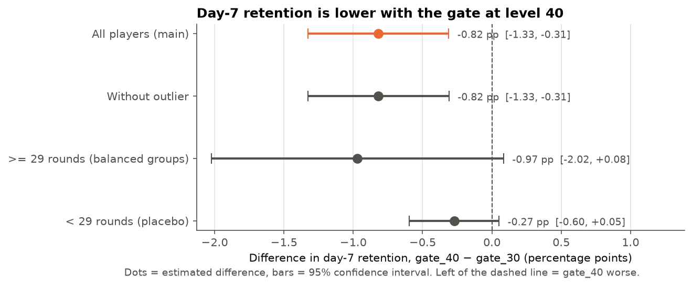
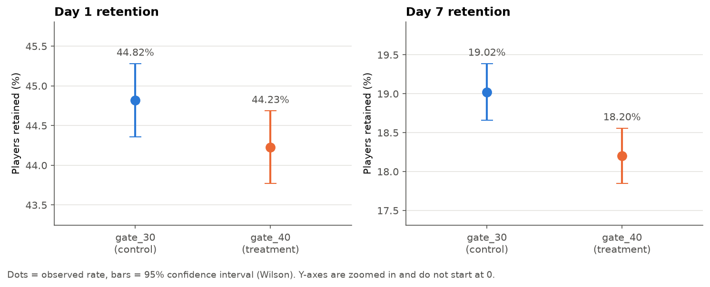
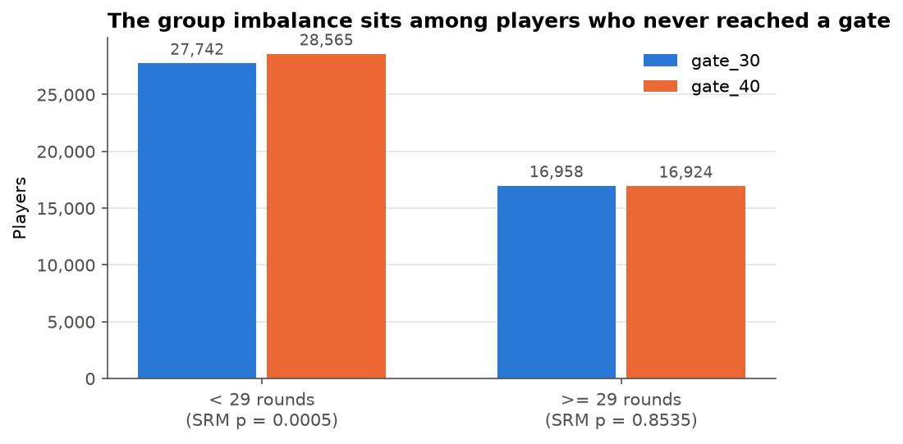
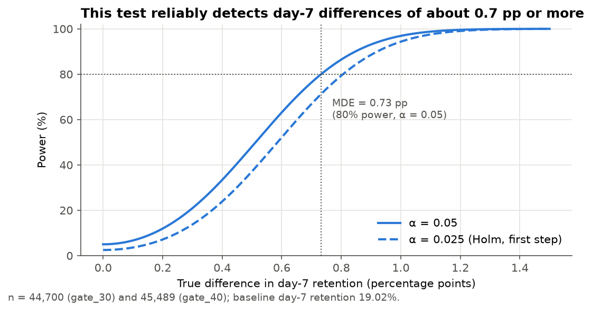
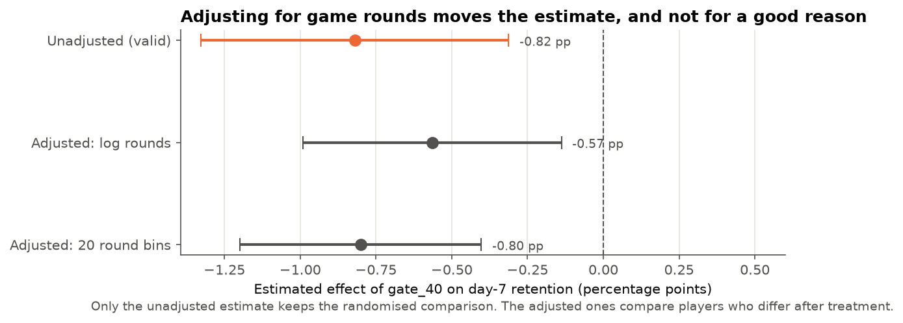

# Cookie Cats A/B Test: Does Moving the First Gate Change Retention?

> **In plain English:** moving the game's first "wait or pay" gate later would lose about 8 of every 1,000 players within a week, so the gate should stay where it is.

**Moving the first gate from level 30 to level 40 lowered 7-day retention from 19.02% to 18.20%, a drop of 0.82 percentage points (95% CI −1.33 to −0.31, Holm-adjusted p = 0.003).** The recommendation is to keep the gate at level 30. A sample ratio mismatch was found and investigated, so the result is reported with that caveat.



## Question
Cookie Cats is a mobile puzzle game. At certain levels, a gate forces players to wait or pay before they can continue. The experiment moved the first gate from level 30 (control) to level 40 (treatment). **Does this change whether players come back after 1 day and after 7 days?**

## Data
- [Mobile Games A/B Testing: Cookie Cats (Kaggle)](https://www.kaggle.com/datasets/mursideyarkin/mobile-games-ab-testing-cookie-cats). 90,189 players, one row per player.
- Columns: `userid`, `version` (gate_30 / gate_40), `sum_gamerounds` (rounds played in the first 14 days), `retention_1`, `retention_7`.
- The raw data isn't included in this repo. Download it from Kaggle (see *How to run*).

## Method
1. **Pre-registered plan.** [`docs/analysis_plan.md`](docs/analysis_plan.md) sets out the hypotheses, metrics, α = 0.05, Holm correction and decision rule. It was committed before any test was run, which you can check in the git history.
2. **Exploration:** data quality checks and outliers in `sum_gamerounds`. One player logged 49,854 rounds in 14 days and was flagged but kept.
3. **Sample ratio mismatch (SRM) check:** a chi-square test of the 50/50 split, followed by an investigation of the imbalance.
4. **Main test:** a two-proportion z-test on day-7 (primary) and day-1 (secondary) retention, with 95% confidence intervals, absolute and relative lift, Holm correction, and a bootstrap (10,000 resamples) as a second method.
5. **Power:** the minimum detectable effect (MDE) at 80% power for this sample size.
6. **Post-treatment trap:** why adjusting for `sum_gamerounds` gives a misleading estimate.

## Results

| Metric | gate_30 | gate_40 | Absolute lift (95% CI) | Relative lift | p (Holm) |
|---|---|---|---|---|---|
| **Day-7 retention** (primary) | 19.02% | 18.20% | **−0.82 pp** [−1.33, −0.31] | −4.3% | **0.003** |
| Day-1 retention (secondary) | 44.82% | 44.23% | −0.59 pp [−1.24, +0.06] | −1.3% | 0.074 |

- **Day-7 retention is significantly lower** with the gate at level 40. The bootstrap confidence interval matches the z-test to within 0.01 pp.
- **Day-1 retention:** no significant difference. Its MDE (0.93 pp) is larger than the observed gap, so this is inconclusive rather than evidence of "no effect".
- **SRM detected** (44,700 vs 45,489, p = 0.0086). No duplicate users, and the imbalance is spread evenly across the user-ID range. It sits **entirely among players with fewer than 29 rounds**, who never reached a gate. Among players who could reach a gate, the groups are balanced (p = 0.85) and show a similar day-7 drop (−0.97 pp [−2.02, +0.08]).
- **Power:** the MDE for day-7 retention is 0.73 pp at 80% power, so the experiment could detect an effect of the size observed.
- **Post-treatment trap:** the gate changes how much people play (p < 0.001). Adjusting for game rounds moves the estimate to between −0.57 and −0.80 pp depending on the model, which is why the unadjusted estimate is the one we use.

For the full walkthrough, see [`notebooks/cookie_cats_ab_test.ipynb`](notebooks/cookie_cats_ab_test.ipynb). For a one-page summary aimed at a game manager, see [`docs/readout.md`](docs/readout.md).

| | |
|---|---|
|  |  |
|  |  |

## Limitations
- **SRM:** the cause of the group imbalance can't be identified from this dataset. It could be chance or a logging/assignment issue, so the result is exploratory until the pipeline is checked.
- **Dilution:** 62% of players played fewer than 29 rounds, so they never reached the level-30 gate. The effect among players who did reach a gate is probably larger than the overall average.
- **No pre-experiment covariates** (install date, country, platform, past activity). We can't check balance on background characteristics or use variance-reduction methods like CUPED.
- This is one historical experiment on one game, so the results may not generalise.

## How to run
```bash
git clone https://github.com/DarkhanMaks/cookie-cats-ab-test.git
cd cookie-cats-ab-test
python -m venv .venv
.venv\Scripts\activate          # Windows  (macOS/Linux: source .venv/bin/activate)
pip install -r requirements.txt
```
1. Download `cookie_cats.csv` from the [Kaggle page](https://www.kaggle.com/datasets/mursideyarkin/mobile-games-ab-testing-cookie-cats) and put it in `data/`.
2. Run the notebook: `jupyter notebook notebooks/cookie_cats_ab_test.ipynb`. It regenerates every chart and CSV in `results/`.

```
├── data/                  # raw data (git-ignored, download from Kaggle)
├── docs/
│   ├── analysis_plan.md   # pre-registered plan (committed before any test)
│   └── readout.md         # one-page summary for a game manager
├── notebooks/
│   └── cookie_cats_ab_test.ipynb
├── results/               # charts (PNG) and aggregated tables (CSV) for Tableau
└── src/
    ├── ab_stats.py        # SRM check, z-test, bootstrap, MDE helpers
    └── plot_style.py      # shared chart style
```
